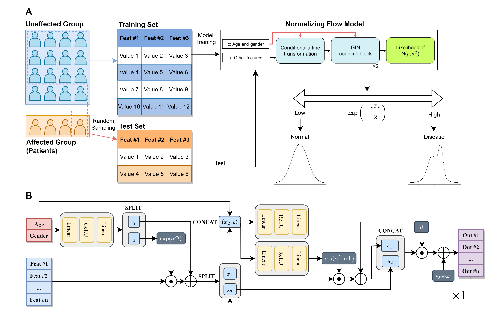

# A machine learning approach using conditional normalizing flow to address extreme class imbalance problems in personal health records
Yeongmin Kim&dagger;, Wongyung Choi&dagger;, Woojeong Choi, Grace Ko, Hwan-Cheol Kim, Dokyoon Kim, Dong-gi Lee, Dong Wook Shin, and Younghee Lee\*

\*Correspondence author  
†Equal contribution

## Abstract
**Background**: Supervised machine learning models have been widely used to predict and get insight into diseases by classifying patients based on personal health records. However, a class imbalance is an obstacle that disrupts the training of the models. In this study, we aimed to address class imbalance with a conditional normalizing flow model, one of the deep-learning-based semi-supervised models for anomaly detection. It is the first introduction of the normalizing flow algorithm for tabular biomedical data.
**Methods**: We collected personal health records from South Korean citizens (n=706), featuring genetic data obtained from direct-to-customer service (microarray chip), medical health check-ups, and lifestyle log data. Based on the health check-up data, six chronic diseases were labeled (obesity, diabetes, hypertriglyceridemia, dyslipidemia, liver dysfunction, and hypertension). After preprocessing, supervised classification models and semi-supervised anomaly detection models, including conditional normalizing flow, were evaluated for the classification of diabetes, which had extreme target imbalance (about 2%), based on AUROC and AUPRC. In addition, we evaluated their performance under the assumption of insufficient collection for patients with other chronic diseases by undersampling disease-affected samples.  
**Results**: While LightGBM (the best-performing model among supervised classification models) showed AUPRC 0.16 and AUROC 0.82, conditional normalizing flow achieved AUPRC 0.34 and AUROC 0.83 during fifty evaluations of the classification of diabetes, whose base rate was very low, at 0.02. Moreover, conditional normalizing flow performed better than the supervised model under a few disease-affected data numbers for the other five chronic diseases – obesity, hypertriglyceridemia, dyslipidemia, liver dysfunction, and hypertension. For example, while LightGBM performed AUPRC 0.20 and AUROC 0.75, conditional normalizing flow showed AUPRC 0.30 and AUROC 0.74 when predicting obesity, while positive undersampling lowered the base rate to 0.02. 
**Conclusions**: Our research suggests the utility of conditional normalizing flow, particularly when the available cases are limited, for predicting chronic diseases using personal health records. This approach offers an effective solution to deal with sparse data and extreme class imbalances commonly encountered in the biomedical context.


## Datasets
The data underlying this article cannot be shared publicly due to the privacy of individuals that participated in the study.

## Code Organization
- constant.py: Usuful constants including key hyperparameters
- main.py: Execution of an overall process
- model_flow.py: Implementation of the architecture of conditional normalizing flow
- train.py: Data preparation and train of the model
- utils.py: Defines CustomCosineAnnealingWarmUpRestarts.

## Installation
First of all, we recommend to use [Pytorch docker](https://hub.docker.com/layers/pytorch/pytorch/1.10.0-cuda11.3-cudnn8-runtime/images/sha256-cf9197f9321ac3f49276633b4e78c79aa55f22578de3b650b3158ce6e3481f61?context=explore) if possible. Note that you need to install git for installation of FrEIA. (apt update => apt install git-all)

These two packages might be critical to execute our code.
- pytorch: 1.10.0 (cuda 11.3)
- [FrEIA](https://github.com/vislearn/FrEIA/commit/76a7d0ac82b07851582e4b0731b2f325a31b4c1d)

The all necessary packages can be installed with:
```
python3 -m pip install -U -r requirements.txt
```

## How to run
- --seed: Fixs seed as the number (Default: 0)
- --use-altub: Operates [AltUB](https://arxiv.org/abs/2210.14913). An option depending on properties of a dataset.
- --eval-all: Evaluates for every possible test set. Being highly time-consuming, not recommended generally.
- --category: Defines a target (a type of disease)

Run the code like:
```
python3 main.py --data data/phr_data.csv --seed 0 --use-altub --eval-all --category diabetes
```

## Architecture of Conditional Normalizing Flow Model on PHR

